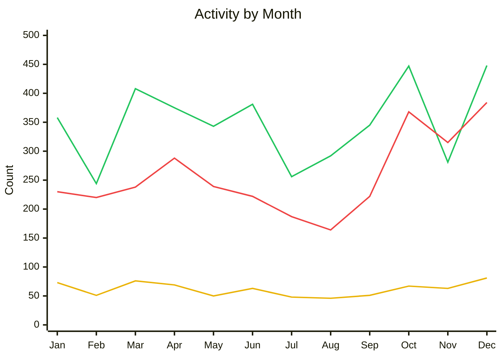

Happy New Year and welcome to the State of the Fin!
This new blog series will regularly basis highlight the ongoing development of Jellyfin and our official clients.
We aim to keep our community informed and engaged, so feel free to share your feedback or thoughts on our progress!

{/* truncate */}

## Project Updates

### Activity

**Dec 01, 2025 – Jan 01, 2026** 
_388 issues closed_ 
_463 PRs merged_ 
_81 contributors_

**Jan 01, 2025 – Dec 31, 2025** 
_3,077 issues closed_ 
_4,178 PRs merged_ 
_411 contributors_

🟢 PRs Merged · 🔴 Issues Closed · 🟡 Contributors

#### Releases

| Date | Repository | Release | Commits |
|------|------------|---------|---------|
| 2025-12-04 | Jellyfin for Roku | [3.0.13](https://github.com/jellyfin/jellyfin-roku/releases/tag/3.0.13) | 47 |
| 2025-12-07 | Jellyfin for Xbox | [v0.9.3 Native Gamepad support, 10.11 server requirement, 4K/HDR fixes](https://github.com/jellyfin/jellyfin-xbox/releases/tag/v0.9.3) | 40 |
| 2025-12-09 | Jellyfin for Roku | [3.0.14](https://github.com/jellyfin/jellyfin-roku/releases/tag/3.0.14) | 13 |
| 2025-12-12 | Swiftfin | [1.4](https://github.com/jellyfin/Swiftfin/releases/tag/1.4) | 411 |
| 2025-12-13 | Jellyfin for Android TV | [v0.19.5](https://github.com/jellyfin/jellyfin-androidtv/releases/tag/v0.19.5) | 8 |
| 2025-12-14 | Jellyfin Desktop | [v2.0.0 - Rename to Jellyfin Desktop / Upgrade to Qt 6](https://github.com/jellyfin/jellyfin-desktop/releases/tag/v2.0.0) | 107 |
| 2025-12-14 | Jellyfin for Xbox | [v0.9.4 Stereo 3D fixes, Cache clear on new version, Bugfix for Server url](https://github.com/jellyfin/jellyfin-xbox/releases/tag/v0.9.4) | 28 |
| 2025-12-19 | Jellyfin for Roku | [3.0.15](https://github.com/jellyfin/jellyfin-roku/releases/tag/3.0.15) | 11 |
| 2025-12-29 | Jellyfin for Android TV | [v0.19.6](https://github.com/jellyfin/jellyfin-androidtv/releases/tag/v0.19.6) | 4 |

### Updates

#### Jellyfin Turns 7

December marked Jellyfin's 7th anniversary!
A lot has changed in 7 years, but we remain steadfast in our commitment to Open Source and to being the best personal media server out there.
Special thanks to our developers, testers, moderators, and supporters for your invaluable contributions!
Here's to many more years of collaboration and streaming!

#### Versioning

We received a substantial amount of feedback regarding our versioning scheme following the 10.11 release, particularly concerning the stability of what are perceived as 'minor' version updates.
This has prompted internal discussions about potentially revising our versioning scheme in the next major release.
While nothing has been finalized yet, we are considering 'dropping' the major version 10, which would make the next release 12.0.
Stay tuned for further updates as we navigate this feedback!

## Development Updates

#### 10.11 Release Status

Jellyfin 10.11 introduced a major [EF Core refactor](https://jellyfin.org/posts/efcore-refactoring-incoming/), consolidating the legacy `library.db` into a single unified `jellyfin.db`.
Following more than six months of development and an additional six months of release candidate testing, version [10.11.0](https://jellyfin.org/posts/jellyfin-release-10.11.0/) was released last year.
This extended testing period allowed us to mitigate most [refactoring](https://github.com/jellyfin/jellyfin/issues/13047) and [RC](https://github.com/jellyfin/jellyfin/issues/14350)-related issues prior to release.

Even with this level of testing, issues were expected given the scale of the database change and the limited number of users reporting bugs.
These issues are currently being tracked on GitHub across three categories:

1. [General bugs](https://github.com/jellyfin/jellyfin/issues/15045)
2. [Performance bugs](https://github.com/jellyfin/jellyfin/issues/15685)
3. [Migration and database bugs](https://github.com/jellyfin/jellyfin/issues/15686)

We have been moving quickly to address these issues, delivering four additional point releases with over [100 changes](https://github.com/jellyfin/jellyfin/compare/v10.11.0...v10.11.5) since the initial 10.11.0 release.
To date, most point releases have focused on resolving general and migration-related issues.
The remaining migration issues are largely isolated, one-off cases and are unlikely to be resolved.
Most general issues have already been fixed, and the next bug-fix release is expected to include additional fixes for music metadata display issues and for watched status not being preserved when media is replaced or renamed.

We are continuing to investigate ways to mitigate performance issues caused by client-side enumeration and filtering of large datasets.

#### Jellyfin Web vNext (aka 10.12 / 12.0)

- **Default 'Experimental' Layout**: The 'Experimental' layout is now enabled by default for all non-TV devices, introducing a new navigation layout and updated UI components.
- **Theming Support Overhaul**: We are improving theming support by enabling easier runtime customization of default themes through CSS variables and simplifying the process for creating new bundled themes.
- **Community Acknowledgment**: Huge thanks to those reviewing, testing, and providing feedback on web pull requests. Your contributions are immensely helpful, as the review burden largely falls on me alone!

\- [thornbill](https://github.com/thornbill)

## Client Corner

### [Jellyfin Desktop](https://github.com/jellyfin/jellyfin-desktop)

_76 issues closed · 30 PRs merged · 7 contributors_

**Top contributors:** @andrewrabert, @alchemyyy, @diced

We're rebranding the desktop application from Jellyfin Media Player to Jellyfin Desktop.
The most noteworthy change is the migration from Qt 5 to Qt 6.
This seems to have improved overall performance, though we're still working out issues regarding memory leaks due to the migration.

Apart from the Qt migration, other noteworthy updates.

- Saved servers and settings will not be migrated from Jellyfin Media Player.
- We've laid the foundation for switching servers with the addition of profiles CLI options. The long-term goal is to have a UI for this as well, but the timeline is TBD.
- A slew of bug fixes are included.

The release is currently available on [Flathub](https://github.com/jellyfin/jellyfin-desktop) and in the [Arch Linux AUR](https://aur.archlinux.org/packages/jellyfin-desktop).
Stable builds for Windows and macOS builds are not currently available.
Other Linux distributions will likely be added, though we recommend using Flathub for the time being.
We are not currently supporting Ubuntu 24.04 LTS due to it being stuck on the older Qt 6.4 series, while our new dependency, mpvqt, requires at least Qt 6.5.

*- [Andrew Rabert](https://github.com/andrewrabert)*

### [Jellyfin for Android TV](https://github.com/jellyfin/jellyfin-androidtv)

_22 issues closed · 64 PRs merged · 4 contributors_

**Maintainer:** [Niels van Velzen](https://github.com/sponsors/nielsvanvelzen)

**Top contributors:** @tobbi007, @damontecres

Two versions of the Android TV app have been released: [v0.19.5](https://github.com/jellyfin/jellyfin-androidtv/releases/tag/v0.19.5) and [v0.19.6](https://github.com/jellyfin/jellyfin-androidtv/releases/tag/v0.19.6)!
These updates contain various improvements to music transcoding. The app now properly displays durations again and allows for seeking when music is transcoding. These changes also solve the issue of lyrics not scrolling in certain cases.

For video playback, we have improved the stability of Live TV and now support direct play for the VC-1 and AV1 codecs (if your device supports them). The AV1 support was already available on Android 10 and newer but now works on older Fire TV devices as well.

*- [Niels van Velzen](https://github.com/nielsvanvelzen)*

### [Jellyfin for Roku](https://github.com/jellyfin/jellyfin-roku)

_15 issues closed · 31 PRs merged · 5 contributors_

**Maintainer:** [1hitsong](https://github.com/sponsors/1hitsong)

**Top contributors:** @jimdogx, @GeekJosh, @VTRunner

[3.0.15](https://github.com/jellyfin/jellyfin-roku/releases/tag/3.0.15) was released on 2025-12-18 and is our last release before Roku's year-end publishing blackout. It fixes a bug with HDHomeRun Tuners.

*- [1hitsong](https://github.com/1hitsong)*

### [Jellyfin for Xbox](https://github.com/jellyfin/jellyfin-xbox)

_16 issues closed · 16 PRs merged · 3 contributors_

**Maintainers:** [Jean-Pierre Bachmann](https://coff.ee/venson), [Tim Gels](https://github.com/sponsors/TimGels)

**Top contributors:** @brad1111

The last two updates brought the long awaited full gamepad support and fixes for 4K and HDR.

- **Gamepad support**: Gamepad navigation is now the default navigation type for the Jellyfin for Xbox app and requires a server version of 10.11 or higher to work. However as we cannot switch the input mode type while the app is running, the Jellyfin for Xbox app can no longer connect to older versions than 10.11. As this is a fundamental change in how the app works, there are still a few hiccups like the app not loading correctly and users reporting that the gamepad does not work at all. In those instances we recommend uninstalling and reinstalling the app.
- **Web UI TV mode**: For versions of Jellyfin earlier than 10.11.5 the web UI still runs in the desktop mode, which might look a bit odd. However, with Jellyfin 10.11.5, we have fixed a bug that now correctly sets the web UI to TV mode, so the UI should work a lot better.
- **4K and HDR**: For the last few versions, we have been working on enabling 4K and HDR for the app. This is done by integrating with the web UI and switching the HDMI modes. Sadly, this also comes at the cost of not being allowed to run in the background. To enable 4K support, we had to use a feature flag that allocates more video memory to the Jellyfin for Xbox app, making it incompatible with running in the background.
- **General Improvements**: Alongside the shiny new headline features, we have also been working on the code in general, adding small improvements and cleaning up a lot of code. The latest versions added log files and their upload to the Jellyfin server, tighter integrations with the web UI, a settings view that can be expanded for future features, version compatibility checking, a better server connection experience, and more.
- **Future**: When I took over the for the previous maintainer almost a year ago, I made a rough plan for the general development of the app. I always planned on keeping the app as a web wrapper because while the app is certainly more popular than most think, it does not have enough support in development to be a full UWP app. Nevertheless, there are a few features left on my to-do list:
  - Localization to other languages
  - Server discovery
  - Desktop support
  - Better decoder support
  - Subtitle storage on-device

*- [JPVenson](https://github.com/JPVenson)*

### [Swiftfin](https://github.com/jellyfin/Swiftfin)

_27 issues closed · 20 PRs merged · 4 contributors_

**Maintainers:** [Ethan Pippin](https://github.com/sponsors/LePips), [Joe Kribs](https://github.com/JPKribs)

**Top contributors:** @magshee, @Lukas-Michel

#### Swiftfin 1.4 is out now!

This is a large release with a lot of changes under the hood. Our three highlight changes are:

1. [Navigation & Routing Overhaul](https://github.com/jellyfin/Swiftfin/pull/1602)
2. [Jellyfin 10.11 Support](https://github.com/jellyfin/Swiftfin/pull/1772)
3. [Revamped Media Player Manager](https://github.com/jellyfin/Swiftfin/pull/1581)

#### Swiftfin Roadmap

A [roadmap / project board](https://github.com/orgs/jellyfin/projects/68) for Swiftfin is now available!

Follow [this discussion](https://github.com/jellyfin/Swiftfin/discussions/1294) for information about the next tvOS release.

To help organize Issues & PRs, Swiftfin now has milestones to help users identify which changes will be included in each release:

- [Version 1.5](https://github.com/jellyfin/Swiftfin/milestone/2)
  - Contains issues that should be resolved in version 1.5 of Swiftfin iOS.
- [tvOS Resync](https://github.com/jellyfin/Swiftfin/milestone/3)
  - Contains tvOS-specific issues that will be resolved as part of our next [tvOS Release](https://github.com/jellyfin/Swiftfin/discussions/1294).
  - _Issues that impact tvOS but are part of 1.4 or 1.5 will end up in the version milestone instead of this one. Once tvOS is released, it should mirror our existing 1.X structure and iOS._

A more detailed post about these changes can be found [on GitHub](https://github.com/jellyfin/Swiftfin/discussions/1832)!

*- [JPKribs](https://github.com/JPKribs)*

## Other Platforms

_12 issues closed · 17 PRs merged · 6 contributors_

**Top contributors:** @mcarlton00, @manuelschneider, @AndryYosua

- The Tizen app was submitted for review, but unfortunately [failed testing](https://github.com/jellyfin/jellyfin-tizen/issues/222#issuecomment-3621581689). Additional work is needed to replicate the reported issues and correct them.
- Support for multiple **new** platforms is currently underway, and we will provide updates as progress is made.

Wishing you all happy streaming in 2026 and beyond!
We look forward to another year filled with exciting updates and features for Jellyfin.

\- thornbill and the Jellyfin Team
