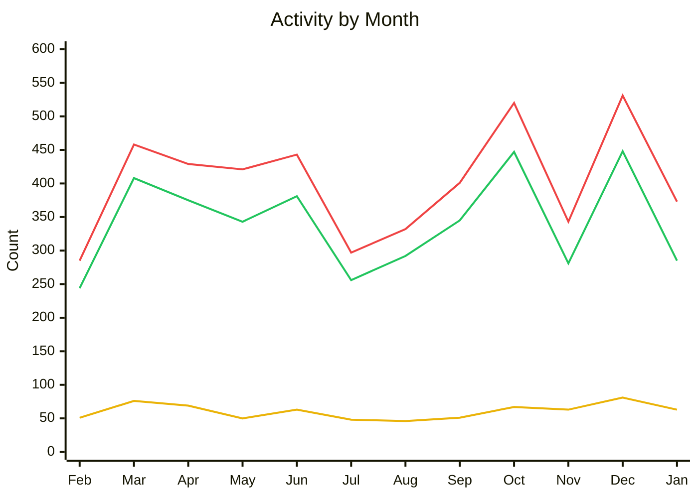

[Write the introduction for this month's State of the Fin here]

{/* truncate */}

## Project Updates

### Activity

**Jan 01, 2026 – Feb 01, 2026** 
_383 issues closed_ 
_295 PRs merged_ 
_66 contributors_

**Feb 01, 2025 – Jan 31, 2026** 
_4,833 issues closed_ 
_4,105 PRs merged_ 
_395 contributors_

🟢 PRs Merged · 🔴 Issues Closed · 🟡 Contributors

#### Releases

| Date | Repository | Release | Commits |
|------|------------|---------|---------|
| 2026-01-02 | Jellyfin Kodi Addon | [Release 0.9.0](https://github.com/jellyfin/jellycon/releases/tag/v0.9.0) | 132 |
| 2026-01-07 | Jellyfin for Roku | [3.1.0-rc1](https://github.com/jellyfin/jellyfin-roku/releases/tag/3.1.0-rc1) | 106 |
| 2026-01-12 | Jellyfin for Roku | [3.1.0](https://github.com/jellyfin/jellyfin-roku/releases/tag/3.1.0) | 3 |
| 2026-01-12 | Jellyfin Kodi Addon | [Release 0.9.1](https://github.com/jellyfin/jellycon/releases/tag/v0.9.1) | 9 |
| 2026-01-14 | Jellyfin for Roku | [3.1.1](https://github.com/jellyfin/jellyfin-roku/releases/tag/3.1.1) | 7 |

### Updates

[Write any project-wide updates here]

## Development Updates

[Write development updates for core projects (server, web, etc.) here]

## Client Corner

### [Jellyfin Desktop](https://github.com/jellyfin/jellyfin-desktop)

_5 issues closed · 4 PRs merged · 1 contributors_

#### What's New

Summarize the highlights for this client during the reporting period.

#### Changes

- Change or fix #1
- Change or fix #2
- Change or fix #3

#### Known Issues

- Any known issues or regressions to call out

#### What's Next

What's planned or in progress for the next period.

*- [Andrew Rabert](https://github.com/andrewrabert)*

### [Jellyfin for Android TV](https://github.com/jellyfin/jellyfin-androidtv)

_45 issues closed · 38 PRs merged · 5 contributors_

**Maintainer:** [Niels van Velzen](https://github.com/sponsors/nielsvanvelzen)

**Top contributors:** @TheMejmun, @flip-dots, @tal-sarid

#### What's New

Summarize the highlights for this client during the reporting period.

#### Changes

- Change or fix #1
- Change or fix #2
- Change or fix #3

#### Known Issues

- Any known issues or regressions to call out

#### What's Next

What's planned or in progress for the next period.

*- [Niels van Velzen](https://github.com/nielsvanvelzen)*

### [Jellyfin for Roku](https://github.com/jellyfin/jellyfin-roku)

_47 issues closed · 42 PRs merged · 5 contributors_

**Maintainer:** [1hitsong](https://github.com/sponsors/1hitsong)

**Top contributors:** @jimdogx, @jessielw, @betilloXann

#### What's New

Summarize the highlights for this client during the reporting period.

#### Changes

- Change or fix #1
- Change or fix #2
- Change or fix #3

#### Known Issues

- Any known issues or regressions to call out

#### What's Next

What's planned or in progress for the next period.

*- [1hitsong](https://github.com/1hitsong)*

### [Jellyfin for Xbox](https://github.com/jellyfin/jellyfin-xbox)

_2 issues closed · 2 PRs merged · 2 contributors_

**Maintainers:** [Jean-Pierre Bachmann](https://coff.ee/venson), [Tim Gels](https://github.com/sponsors/TimGels)

#### What's New

Summarize the highlights for this client during the reporting period.

#### Changes

- Change or fix #1
- Change or fix #2
- Change or fix #3

#### Known Issues

- Any known issues or regressions to call out

#### What's Next

What's planned or in progress for the next period.

*- [JPVenson](https://github.com/JPVenson)*

### [Swiftfin](https://github.com/jellyfin/Swiftfin)

_5 issues closed · 4 PRs merged · 2 contributors_

**Maintainer:** [Ethan Pippin](https://github.com/sponsors/LePips)

**Top contributors:** @JPKribs, @chickdan

#### What's New

Summarize the highlights for this client during the reporting period.

#### Changes

- Change or fix #1
- Change or fix #2
- Change or fix #3

#### Known Issues

- Any known issues or regressions to call out

#### What's Next

What's planned or in progress for the next period.

*- [JPKribs](https://github.com/JPKribs)*

## Other Platforms

_11 issues closed · 8 PRs merged · 3 contributors_

**Top contributors:** @mcarlton00

#### What's New

Summarize the highlights for these clients during the reporting period.

#### Changes

- Change or fix #1
- Change or fix #2
- Change or fix #3

#### Known Issues

- Any known issues or regressions to call out

#### What's Next

What's planned or in progress for the next period.

[Write closing remarks here]
