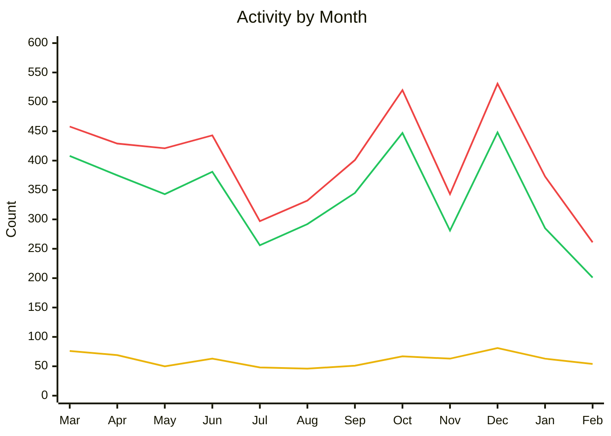

[Write the introduction for this month's State of the Fin here]

{/* truncate */}

## Project Updates

### Activity

**Feb 01, 2026 – Mar 01, 2026** 
_264 issues closed_ 
_202 PRs merged_ 
_54 contributors_

**Mar 01, 2025 – Feb 28, 2026** 
_4,809 issues closed_ 
_4,062 PRs merged_ 
_404 contributors_

🟢 PRs Merged · 🔴 Issues Closed · 🟡 Contributors

#### Releases

| Date | Repository | Release | Commits |
|------|------------|---------|---------|
| 2026-02-01 | Jellyfin for Roku | [3.1.2-rc1](https://github.com/jellyfin/jellyfin-roku/releases/tag/3.1.2-rc1) | 100 |
| 2026-02-03 | Jellyfin for Android TV | [v0.19.7](https://github.com/jellyfin/jellyfin-androidtv/releases/tag/v0.19.7) | 6 |
| 2026-02-04 | Jellyfin for Roku | [3.1.2](https://github.com/jellyfin/jellyfin-roku/releases/tag/3.1.2) | 9 |
| 2026-02-06 | Jellyfin for Roku | [3.1.3](https://github.com/jellyfin/jellyfin-roku/releases/tag/3.1.3) | 8 |
| 2026-02-10 | Jellyfin for Roku | [3.1.4](https://github.com/jellyfin/jellyfin-roku/releases/tag/3.1.4) | 19 |
| 2026-02-11 | Jellyfin for Roku | [3.1.5](https://github.com/jellyfin/jellyfin-roku/releases/tag/3.1.5) | 6 |

### Updates

[Write any project-wide updates here]

## Development Updates

[Write development updates for core projects (server, web, etc.) here]

## Client Corner

### [Jellyfin Desktop](https://github.com/jellyfin/jellyfin-desktop)

_21 issues closed · 18 PRs merged · 7 contributors_

**Top contributors:** @andrewrabert, @MrEricSir, @iamfil

#### What's New

Summarize the highlights for this client during the reporting period.

#### Changes

- Change or fix #1
- Change or fix #2
- Change or fix #3

#### Known Issues

- Any known issues or regressions to call out

#### What's Next

What's planned or in progress for the next period.

*- [Andrew Rabert](https://github.com/andrewrabert)*

### [Jellyfin for Android TV](https://github.com/jellyfin/jellyfin-androidtv)

_32 issues closed · 27 PRs merged · 6 contributors_

**Maintainer:** [Niels van Velzen](https://github.com/sponsors/nielsvanvelzen)

**Top contributors:** @galaterro, @skalthoff, @WizardOfYendor1

#### What's New

Summarize the highlights for this client during the reporting period.

#### Changes

- Change or fix #1
- Change or fix #2
- Change or fix #3

#### Known Issues

- Any known issues or regressions to call out

#### What's Next

What's planned or in progress for the next period.

*- [Niels van Velzen](https://github.com/nielsvanvelzen)*

### [Jellyfin for Roku](https://github.com/jellyfin/jellyfin-roku)

_37 issues closed · 34 PRs merged · 7 contributors_

**Maintainer:** [1hitsong](https://github.com/sponsors/1hitsong)

**Top contributors:** @jimdogx, @michaelcresswell, @FractalBoy

#### What's New

Summarize the highlights for this client during the reporting period.

#### Changes

- Change or fix #1
- Change or fix #2
- Change or fix #3

#### Known Issues

- Any known issues or regressions to call out

#### What's Next

What's planned or in progress for the next period.

*- [1hitsong](https://github.com/1hitsong)*

### [Jellyfin for Xbox](https://github.com/jellyfin/jellyfin-xbox)

_5 issues closed · 5 PRs merged · 1 contributors_

**Maintainers:** [Jean-Pierre Bachmann](https://coff.ee/venson), [Tim Gels](https://github.com/sponsors/TimGels)

**Top contributors:** @dfederm

#### What's New

Summarize the highlights for this client during the reporting period.

#### Changes

- Change or fix #1
- Change or fix #2
- Change or fix #3

#### Known Issues

- Any known issues or regressions to call out

#### What's Next

What's planned or in progress for the next period.

*- [JPVenson](https://github.com/JPVenson)*

### [Swiftfin](https://github.com/jellyfin/Swiftfin)

_11 issues closed · 7 PRs merged · 4 contributors_

**Maintainer:** [Ethan Pippin](https://github.com/sponsors/LePips)

**Top contributors:** @JPKribs, @ShiSheng233, @Comet1903

#### What's New

Summarize the highlights for this client during the reporting period.

#### Changes

- Change or fix #1
- Change or fix #2
- Change or fix #3

#### Known Issues

- Any known issues or regressions to call out

#### What's Next

What's planned or in progress for the next period.

*- [JPKribs](https://github.com/JPKribs)*

## Other Platforms

_9 issues closed · 8 PRs merged · 4 contributors_

**Top contributors:** @kylemartinperez, @andrewrabert, @MelanX

#### What's New

Summarize the highlights for these clients during the reporting period.

#### Changes

- Change or fix #1
- Change or fix #2
- Change or fix #3

#### Known Issues

- Any known issues or regressions to call out

#### What's Next

What's planned or in progress for the next period.

[Write closing remarks here]
