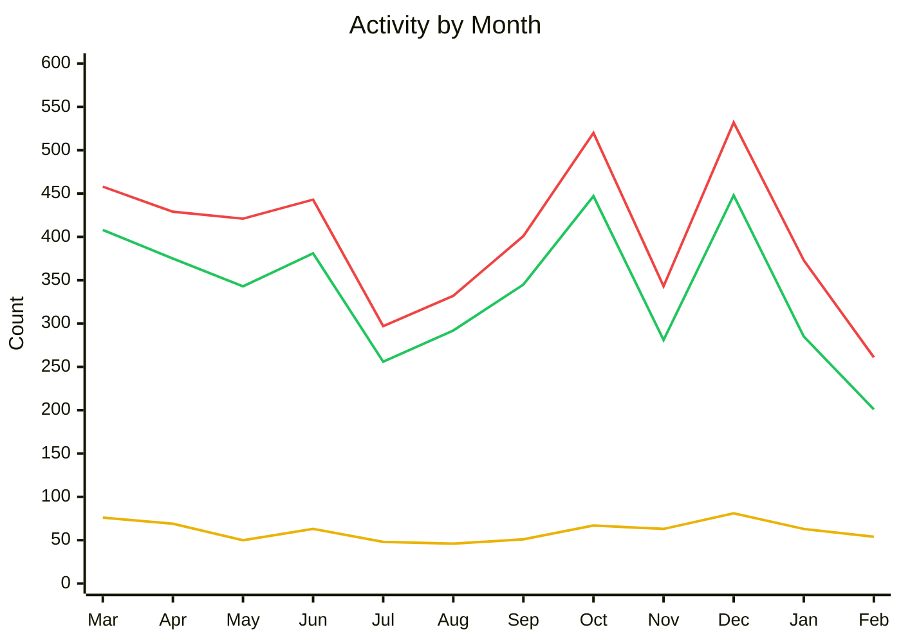

Welcome to the second edition of State of the Fin! This update will be slightly different to the previous one as we don't have as many large updates to announce (yet)! Still, we want to keep you informed on what is happening and what the Jellyfin development team are working on. Please enjoy, and contribute through our [standard channels](https://jellyfin.org/contact/) if you have questions or comments.

{/* truncate */}

## Project Updates

### Activity

**Feb 01, 2026 – Mar 01, 2026** 
_276 issues closed_ 
_214 PRs merged_ 
_56 contributors_

**Mar 01, 2025 – Feb 28, 2026** 
_4,810 issues closed_ 
_4,062 PRs merged_ 
_404 contributors_

🟢 PRs Merged · 🔴 Issues Closed · 🟡 Contributors

#### Releases

| Date | Repository | Release | Commits |
|------|------------|---------|---------|
| 2026-02-01 | Jellyfin for Roku | [3.1.2-rc1](https://github.com/jellyfin/jellyfin-roku/releases/tag/3.1.2-rc1) | 100 |
| 2026-02-03 | Jellyfin for Android TV | [v0.19.7](https://github.com/jellyfin/jellyfin-androidtv/releases/tag/v0.19.7) | 6 |
| 2026-02-04 | Jellyfin for Roku | [3.1.2](https://github.com/jellyfin/jellyfin-roku/releases/tag/3.1.2) | 9 |
| 2026-02-06 | Jellyfin for Roku | [3.1.3](https://github.com/jellyfin/jellyfin-roku/releases/tag/3.1.3) | 8 |
| 2026-02-10 | Jellyfin for Roku | [3.1.4](https://github.com/jellyfin/jellyfin-roku/releases/tag/3.1.4) | 19 |
| 2026-02-11 | Jellyfin for Roku | [3.1.5](https://github.com/jellyfin/jellyfin-roku/releases/tag/3.1.5) | 6 |

### Updates

### LLM/"AI"Policy

As with pretty much every open source project, we have been inundated with AI-authored pull requests of varying quality. This has vastly increased the amount of work the team has on their plate. To that end, an LLM/AI Policy has been created to try and help set standards. The tl;dr is **AI use isn't completely forbidden in pull requests/code submissions, however you must understand HOW it does what it does, and any posts to a pull request/issue should be written by the user. You cannot function as a go-between between your AI and our questions/comments, just copy-pasting whatever the AI tells you.** For more information, please read the [LLM/"AI" developmental policy](https://jellyfin.org/docs/general/contributing/llm-policies/) we have published.

The Jellyfin Team is made up of a lot of different people, and everyone has different levels of acceptance of/interest in code that an AI agent has contributed to. This policy has been made to try and help find a path that everyone can at least appreciate, even if they don't fully agree.

You may also see AI agents committing to projects that are run by the Jellyfin development team. These are not "AI slop" commits. The development team may be experimenting with (or fully using) an agent to help handle some of the tasks involved with writing and managing a large project like this, but the author (not the AI one) is experienced enough with the code to find the stuff the agent does wrong and fix it. That's why they're on the development team.

### Burnout / Remember the Person

Jellyfin has been growing quickly as the landscape around us matures and changes. This is both a blessing and a curse. It is great that Jellyfin is so popular and loved by so many, however the increased support requests, combined with the AI code submissions, has lead to burnout at various levels of the development and admin team. Abuse from users when something isn't working only increases the loss of motivation. This has already lead to delays in client and server improvements.

Please remember Jellyfin is open source and is written by volunteers. There are real people doing the work, and they're doing this for the love of the project. Yelling at them/insulting them will not make anything happen faster, and is actually more likely to delay fixes or improvements.

If you'd like to get involved in helping fellow users, hang out in the [standard matrix/discord channels](https://jellyfin.org/contact/), or look at the [forums](https://forum.jellyfin.org/)/[subreddit](https://reddit.com/r/jellyfin) and volunteer answers when you think the question is something you know. Straight AI searching and copy-paste answering aren't good responses, but if it's something you have dealt with, please contribute! The more people who help answer the easy questions, the more we can allow the devs to work on the hard stuff.

## Development Updates

### Current version

Jellyfin server [v10.11.6](https://github.com/jellyfin/jellyfin/releases/tag/v10.11.6) is the current version of Jellyfin server.

### What's Next

The next server version is going to be called v12, moving on from the v10.x versioning. There is a [v12 Github project](https://github.com/orgs/jellyfin/projects/73) that you can look at to see the current status. The biggest change for v12 is in the [Query Perfomance Improvments PR](https://github.com/jellyfin/jellyfin/pull/16062). This not only fixes a lot of performance issues, it also fixes some other non-performance bugs we are encountering in v10.11.

If you have the knowledge and ability to test the [Query Perfomance Improvments PR](https://github.com/jellyfin/jellyfin/pull/16062), please do! The more feedback we get on the changes, the faster this can be released to everyone. The standard development warnings apply: Don't use this as your main server, make sure you have current backups of all your data, and it's suggested you only allow readonly access to your media libraries, just to be safe.

Separately, there's work being done to help give users the opportunity to test new builds more easily. Right now the process of testing a PR involves checking out the code and [building that branch manually](https://github.com/jellyfin/jellyfin-packaging), either in a container or natively. People are working on scripts and environments to make this more user-friendly, which hopefully will allow people to more quickly and easily test fixes and changes.

### Current Hot Issues/Questions

There are a couple issues/questions in the current version that we often see in support channels. They are:

* Deleting/restructuring files and directories in a library can cause library rescanning to fail, preventing updates of new files and/or "ghost" entries/duplicates for some shows
  * This is covered in [this issue](https://github.com/jellyfin/jellyfin/issues/15343)
  * The fix is generally to recreate the old directory structure and rescan. Look at server logs to see what folders the rescan is breaking on. Once a rescan successfully completes you can remove the empty directories.
* Jellyfin Desktop: See the Jellyfin Desktop section in the Client Corner part of this blog.
* Hardware suggestions: Our documentation has a section about [selecting appropriate hardware](https://jellyfin.org/docs/general/administration/hardware-selection) that can help.
* Transcoding questions: Our documentaiton has a section about [transcoding](https://jellyfin.org/docs/general/post-install/transcoding/) that can help.

As always, you can feel free to [ask us for help](https://jellyfin.org/contact/) with your questions or issues, but reading the above may help save some time for both you and the people helping you.

## Client Corner

### [Jellyfin Desktop](https://github.com/jellyfin/jellyfin-desktop)

_27 issues closed · 24 PRs merged · 7 contributors_

**Top contributors:** @MrEricSir, @andrewrabert, @iamfil

#### What's New

Jellyfin Desktop v2.0 was announced and some intial packaging was done for a couple platforms. It is built upon Qt libraries, like Jellyfin Media Player (v1 of the same software) was. Around that same time a [severe memory leak](https://github.com/jellyfin/jellyfin-desktop/issues/1091) in the Qt libraries was discovered. This halted all improvements/packaging. To date, this issue still exists in the Qt libraries.

As an alternative, work was started on an SDL/CEF version. This version (which we're going to call Jellyfin Desktop v3) is fairly functional and ready for testing. We would appreciate user testing and feedback to help complete and polish the first version of v3! You can find the updated version at the [jellyfin-cef repository](https://github.com/jellyfin-labs/jellyfin-desktop-cef).

This project is also being done as an experiment with using Claude to migrate from the old codebase. This migration is being done by someone who worked extensively on previous versions and is not just using Claude to create "AI slop". See elsewhere in this blog post for our discussion on AI.

Please see the [CEF issues page](https://github.com/jellyfin-labs/jellyfin-desktop-cef/issues) for current issues/workarounds with the new version.

#### What's Next

The jellyfin/jellyfin-desktop repository will be renamed to jellyfin/jellyfin-desktop-qt, and the jellyfin-labs/jellyfin-desktop-cef repository will be moved to jellyfin/jellyfin-desktop (where the old Qt-library-version originally was), so if you're reading this blog post long after it originally comes out, you may find the repositories referenced here have changed.

Besides that, we are continuing work and improvements on the new version.

*- [Andrew Rabert](https://github.com/andrewrabert)*

### [Jellyfin for Android TV](https://github.com/jellyfin/jellyfin-androidtv)

_33 issues closed · 28 PRs merged · 6 contributors_

**Maintainer:** [Niels van Velzen](https://github.com/sponsors/nielsvanvelzen)

**Top contributors:** @galaterro, @skalthoff, @WizardOfYendor1

#### What's New

Minor version [0.19.7](https://github.com/jellyfin/jellyfin-androidtv/releases/tag/v0.19.7) came out in February. This is the most recent release.

Besides that, various translation improvements have been committed to the main branch, ready for a future release. Thanks to all contributors!

*- [Niels van Velzen](https://github.com/nielsvanvelzen)*

### [Jellyfin for Roku](https://github.com/jellyfin/jellyfin-roku)

_37 issues closed · 34 PRs merged · 7 contributors_

**Maintainer:** [1hitsong](https://github.com/sponsors/1hitsong)

**Top contributors:** @jimdogx, @michaelcresswell, @FractalBoy

#### What's New

Since the last State of the Fin blog post, major version v3.1 of the roku client was released. The current version is [v3.1.7](https://github.com/jellyfin/jellyfin-roku/releases/tag/3.1.7). This has incorporated multiple fixes for HDR, display issues, and more.

Thanks to all contributors!

*- [1hitsong](https://github.com/1hitsong)*

### [Jellyfin for Xbox](https://github.com/jellyfin/jellyfin-xbox)

_5 issues closed · 5 PRs merged · 1 contributors_

**Maintainers:** [Jean-Pierre Bachmann](https://coff.ee/venson), [Tim Gels](https://github.com/sponsors/TimGels)

**Top contributors:** @dfederm

#### Changes

Various translation improvements and fixes have been committed to the main branch, ready for a future release. Thanks to all contributors!

*- [JPVenson](https://github.com/JPVenson)*

### [Swiftfin](https://github.com/jellyfin/Swiftfin)

_11 issues closed · 7 PRs merged · 4 contributors_

**Maintainer:** [Ethan Pippin](https://github.com/sponsors/LePips)

**Top contributors:** @JPKribs, @ShiSheng233, @Comet1903

#### What's New

Various translation improvements and fixes have been committed to the main branch, ready for a future release. Thanks to all contributors!

*- [JPKribs](https://github.com/JPKribs)*

## Other Platforms

_12 issues closed · 11 PRs merged · 6 contributors_

**Top contributors:** @mcarlton00, @GoD-Tony, @kylemartinperez

The [Tizen Jellyfin client](https://github.com/jellyfin/jellyfin-tizen) for Tizen 6 and newer has been released to the Samsung Tizen Store! Tizen 5 and earlier should still be able to side-load the client.

While this post isn't full of new announcements, it's worth posting so you know people are still working on things in the background. Jellyfin was originally forked from Emby, however the projects have different goals and directions. For Jellyfin, this includes some very deep rewrites of core code, which takes a lot of time and effort. It is necessary to help the codebase mature for the future of the project. We hope with the extra details given in this blog, which are public but generally not broadcasted, you can appeciate the scope and size of the jellyfin work, and the people behind it. Thank you for using and supporting Jellyfin!
